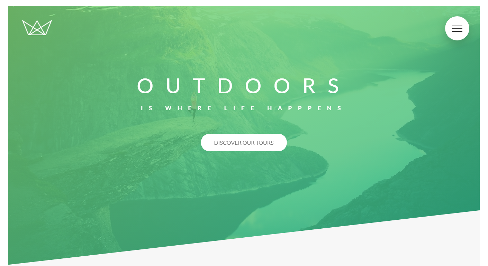

# Natours-project
This project is part of Jonas Schmedtman advanced CSS course. 
This course includes Responsive design, animations, and advanced css concepts.  

## Live Demo
Checkout live demo here: https://ourandco.github.io/Natours-project/

### Technologies
HTML 5 
CSS (intermediate to Advanced) 
Sass 
NPM (node package manager) 
live-server 
### Resources
Google fonts 
Linea font icons 
jonas images (project file.) 
unsplash.com(images) 
coverr.co (videos) 
cubic-bezier.com 
easings.net 
loremipsumgenerator.com 
sizzy.co (Responsive design test)  

#### BEM METHADOLOGY.
#### Author
:bust_in_silhouette: Jonas Schmedtman
#### Student
:bust_in_silhouette: M. Alamgir

#### Copyrights
:bust_in_silhouette: Jonas Schmedtman
